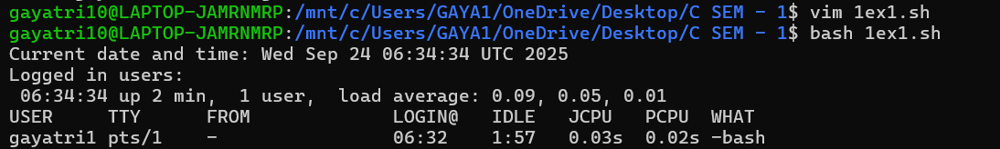
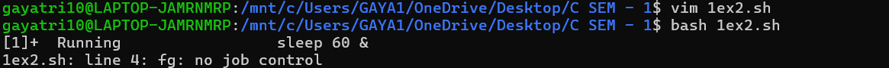
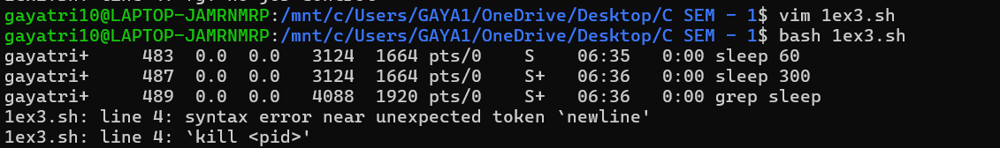
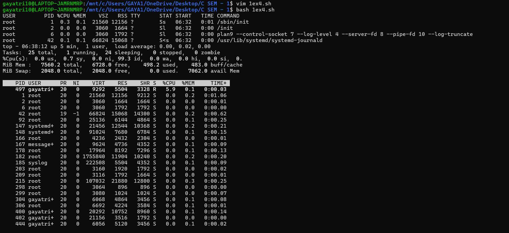
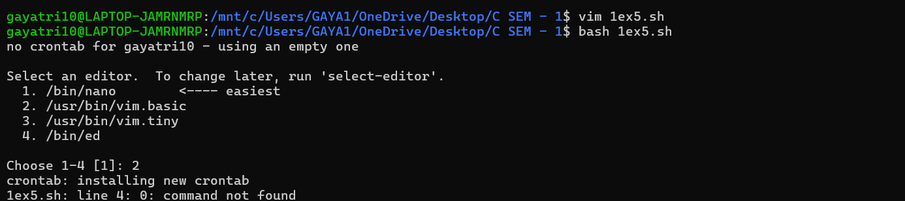
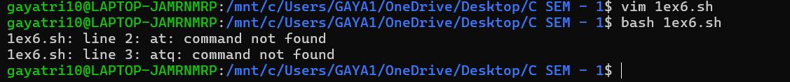

## Experiment 7: Shell Programming, Process and Scheduling

### Name: Gayatri Bhatt  Roll No.: 590023785   Date: 2025-09-23

### Aim:

* To write shell scripts that demonstrate process management.
* To understand how to schedule processes using `cron` and `at`.
* To monitor running processes and practice job control commands.

### Requirements

* A Linux machine with bash shell.
* Access to process management commands (`ps`, `top`, `kill`, `jobs`, `fg`, `bg`).
* Access to scheduling utilities (`cron`, `at`).

## Theory

Every program running in Linux is a process identified by a unique process ID (PID). Shell programming allows automation of tasks including spawning and controlling processes. Process management commands like `ps`, `top`, `kill`, `jobs`, `bg`, and `fg` let users monitor and control execution. Scheduling utilities such as `cron` (repeated tasks) and `at` (one-time tasks) allow tasks to run automatically at defined times. Combining scripting with scheduling is a core system administration skill.

## Procedure & Observations

## Exercise 1: Writing a basic shell script

### Task Statement:

Create a shell script that prints the current date, time, and the list of logged-in users.

### Command(s):

```bash
#!/bin/bash
echo "Current date and time: $(date)"
echo "Logged in users:"
w
```

### Output:

<p align="center">

</p>

---

## Exercise 2: Background and foreground processes

### Task Statement:

Run a process in background and bring it to the foreground.

### Command(s):

```bash
sleep 60 &
jobs
fg %1
```

### Output:

<p align="center">

</p>

---

## Exercise 3: Killing a process

### Task Statement:

Start a process and terminate it using `kill`.

### Command(s):

```bash
sleep 300 &
ps aux | grep sleep
kill <pid>
```

### Output:

<p align="center">

</p>

---

## Exercise 4: Monitoring processes

### Task Statement:

Use `ps` and `top` to monitor processes.

### Command(s):

```bash
ps aux | head -5
top
```

### Output:

<p align="center">

</p>

---

## Exercise 5: Using `cron` for scheduling

### Task Statement:

Schedule a script to run every day at 7:00 AM using `cron`.

### Command(s):

```bash
crontab -e
# Add the following line
0 7 * * * /home/user/myscript.sh
```

### Output:

<p align="center">

</p>

---

## Exercise 6: Using `at` for one-time scheduling

### Task Statement:

Schedule a script to run once at a specified time using `at`.

### Command(s):

```bash
echo "/home/user/myscript.sh" | at 08:30
atq
```

### Output:

<p align="center">

</p>

---
## Task 1 

### Task Statement

Write a script that monitors the top 5 processes consuming the most CPU and logs them into a file every 10 seconds.

### Command(s)

```bash
for i in {0..5}; do
    echo "LOG on $(date)" >> output.txt
    ps -eo pid,comm,%cpu --sort=-%cpu | head -6 >> output.txt
    echo "------------------------------------------" >> output.txt
    sleep 10
done
```

### Output

<p align="center">

</p>

***

## Task 2

### Task Statement

Write a script that accepts a PID from the user and displays its details (state, parent process, memory usage).

### Command(s)

```bash
#!/bin/bash

read -p "Enter the PID of the process: " pid

echo "Details for PID $pid:"
ps -p "$pid" -o pid,ppid,state,comm,%mem,%cpu
```

### Output

<p align="center">

</p>

***

## Task 3

### Task Statement

Create a script that schedules a task to append the current date and time to a log file every minute using cron.

### Command(s)

```bash
#!/bin/bash
echo "$(date)" >> time_log.txt

```
```
crontab -e

* * * * * ~/log_time.sh
```

### Output

<p align="center">

</p>

***

## Task 4:

### Task Statement
Modify the factorial function to check if input is negative. If yes, display an error message.

### Command(s)

```bash
#!/bin/bash

factorial() {
    local n=$1

    if [ $n -lt 0 ]; then
        echo "Error: Factorial is not defined for negative numbers."
        return 1
    fi

    local fact=1
    for (( i=1; i<=n; i++ )); do
        fact=$((fact * i))
    done
    echo "Factorial of $n is $fact"
}

read -p "Enter a number: " num
factorial $num
```

### Output

<p align="center">

</p>

***

## Task 5

### Task Statement

Schedule a script to run every day at 7:00 AM using `cron`.

### Command(s)

```bash
#!/bin/bash
echo "Script ran at $(date)" >> ~/daily_log.txt
```

```bash
crontab -e
0 7 * * * ~/my_script.sh
```

### Output

<p align="center">

</p>


## Result

* Learned to create and run shell scripts.
* Managed processes using background, foreground, and kill commands.
* Monitored processes with `ps` and `top`.
* Scheduled recurring tasks with `cron` and one-time tasks with `at`.

## Challenges Faced & Learning Outcomes

* Challenge 1: Remembering the `crontab` time format. Solved by using online crontab generators and practice.
* Challenge 2: Ensuring `atd` service is running for `at` command. Fixed by starting the service with `systemctl start atd`.

### Learning:

* Gained hands-on knowledge of process creation and termination.
* Learned job control and scheduling using `cron` and `at`.

## Conclusion

This experiment provided practical experience with shell scripting, process management, and scheduling. These are critical skills for system administrators to automate and control Linux environments effectively.
